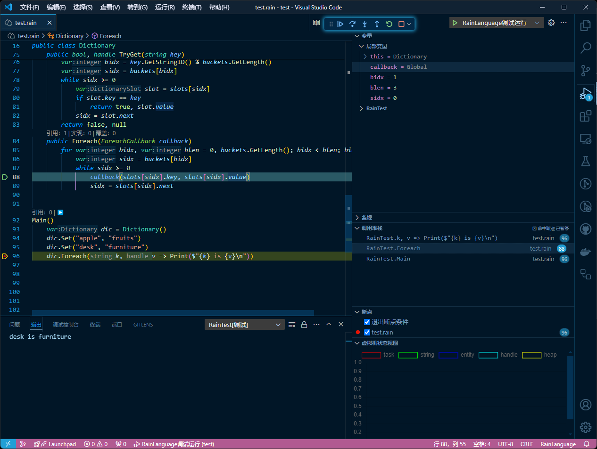

vscode的RainLanguage扩展插件

简体中文 | [English](./readme_en.md)

为RainLanguage提供语言服务和运行调试功能

### 语言服务
- 定义跳转
- 引用查找
- 代码补全
- 代码悬停
- 语法检查
- 语义着色
- 语义检查
- 内联提示
- CodeLens
### 运行和调试功能
- 运行代码并调试

**在`.vscode/launch.json`文件中点击`添加配置`按钮，选择*RainLanguage: 调试运行*即可自动创建用于运行代码并调试的配置模板（将鼠标悬停在属性名称上方可以查看各属性的作用）**

- 附加到进程

**在`.vscode/launch.json`文件中点击`添加配置`按钮，选择*RainLanguage: 附加到进程*即可自动创建用于附加到其他进程并调试的配置模板**

## 🙋RainLanguage简介

RainLanguage是一种专为游戏开发设计的编程语言，采用了类似Python的简洁语法，旨在提供高效且易于使用的开发体验。以下是该语言的详细特点：
- 类型系统：RainLanguage在编译时进行类型检查，确保类型安全，同时具有强大的类型推导能力，减少了显式类型声明的需求。
- 性能优化：支持栈上内存分配的类型声明，有助于减少垃圾回收（GC）的压力，从而实现比Lua更好的性能。
- 平台支持：目前RainLanguage支持Windows、Linux和Android移动平台，为多平台游戏开发提供了灵活性。
- 开源许可：采用GPLv3.0协议发布，鼓励开源社区的贡献和协作。
- 游戏引擎集成：RainLanguage可以直接在Unreal Engine中使用，并且为Unity提供了非常完善的适配器，方便开发者将其集成到这两个主流的游戏引擎中。

这些特性使得RainLanguage成为游戏开发者的一个有力工具，特别是在需要高性能和跨平台支持的项目中。

