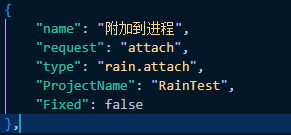

# vscode的RainLanguage扩展插件

为雨言提供语言服务和运行调试功能

### 语言服务
- 基于语义的代码高亮
- 实时的语法错误检查
- 显示各定义的引用信息
- 对于省略信息的内联提示
- 代码补全功能
- 函数的符号帮助功能
### 运行和调试功能
- 运行代码并调试

**在`.vscode/launch.json`文件中点击`添加配置`按钮，选择*RainLanguage: 调试运行*即可自动创建用于运行代码并调试的配置模板（将鼠标悬停在属性名称上方可以查看各属性的作用）**

- 附加到进程

**在`.vscode/launch.json`文件中点击`添加配置`按钮，选择*RainLanguage: 附加到进程*即可自动创建用于附加到其他进程并调试的配置模板**

